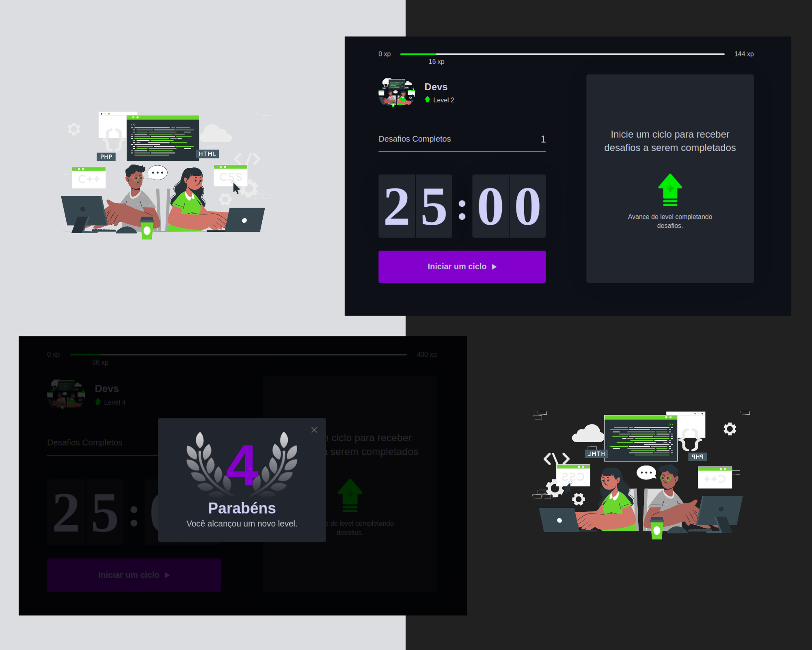

<h1 align="center">
    
    <br>Moveit-dev<br/>
</h1>

<p align="center">
    </img>
  </a>

  </a>
    </img>
  </a>
  </a>
    </img>
  </a>

</p>

## 💻 Projeto

O **Moveit-dev** é um App que utiliza a técnica de [pomodoro](https://pt.wikipedia.org/wiki/T%C3%A9cnica_pomodoro), com o objetivo de melhorar sua produtividade e foco. Desenvolvido durante a Next Level Week #4 da Rocketseat.

<br/>

<h1 align="center">
    
</h1>

<br/>

## 🚀 Tecnologias

Tecnologias e ferramentas utilizadas no desenvolvimento do projeto:

- React
- Next.js
- TypeScript
- Js-cookie
- React-dom

<br/>

## Como Executar

### **Pré-requisitos**

- É **necessário** possuir o **[Node.js](https://nodejs.org/en/)** instalado no computador
- É **necessário** possuir o **[Git](https://git-scm.com/)** instalado e configurado no computador
- Também, é **preciso** ter um gerenciador de pacotes seja o **[NPM](https://www.npmjs.com/)** ou **[Yarn](https://yarnpkg.com/)**.

 <br/>

Para clonar e executar este aplicativo,
execute os seguintes comando.

1. Faça um clone do repositório:

```sh
  $ https://github.com/Djaysson/moveit-dev.git
```

2. Executando a Aplicação:

```sh
  # Aplicação web
  $ cd moveit-dev
  # Instalando as dependências do projeto.
  $ yarn install # ou npm install
  # Inicie a aplicação web
  $ yarn dev # ou npm dev

```

Desenvolvido por Djayson Rodrigues 👋 [Entrar em contato!](https://www.linkedin.com/in/djaysonrodrigues/)
