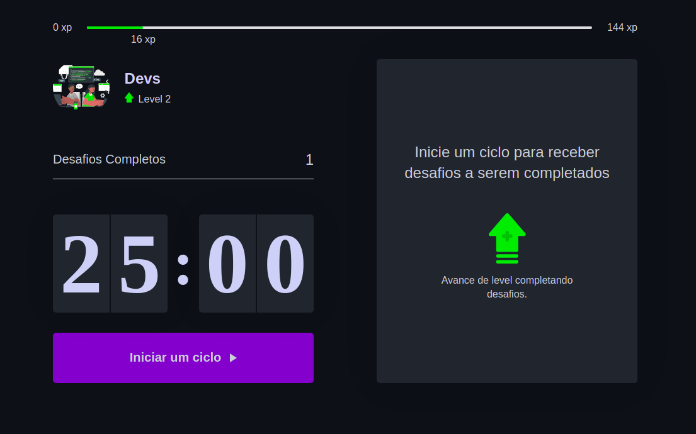

<h1  align="center">
    
    Moveit-dev
</h1>
<p align="center">
  
  
  
  
</p>

## 💻 Projeto Moveit-dev

O **Moveit-dev** é um App que utiliza a técnica de [pomodoro](https://pt.wikipedia.org/wiki/T%C3%A9cnica_pomodoro), com o objetivo de melhorar sua produtividade e foco. Desenvolvido durante a Next Level Week #4 da Rocketseat.

<br/>
<p align="center">
  <a href="https://www.figma.com/file/n9J6604nMGB7Cgt2vEVtWb/Move.it-1.0-Dark-Mode">
    
  </a>
</p>
<br/>
<h1 align="center">
    
</h1>

## Tecnologias

Tecnologias e ferramentas utilizadas no desenvolvimento do projeto:

- [React](https://reactjs.org/)
- [Next.js](https://nextjs.org/)
- [TypeScript](https://www.typescriptlang.org/)

<br/>

## Autor
[](https://br.linkedin.com/in/djaysonrodrigues)


<br/>

## Como Executar

### **Pré-requisitos**

  - É **necessário** possuir o **[Node.js](https://nodejs.org/en/)** instalado no computador
  - É **necessário** possuir o **[Git](https://git-scm.com/)** instalado e configurado no computador
  - Também, é **preciso** ter um gerenciador de pacotes seja o **[NPM](https://www.npmjs.com/)** ou **[Yarn](https://yarnpkg.com/)**.
 
 <br/>

Para clonar e executar este aplicativo,
execute os seguintes comando.

1. Faça um clone do repositório:

```sh
  $ https://github.com/Djaysson/moveit-dev.git
```

2. Executando a Aplicação:

```sh 
  # Aplicação web
  $ cd moveit-dev
  # Instalando as dependências do projeto.
  $ yarn install # ou npm install
  # Inicie a aplicação web
  $ yarn dev # ou npm dev

```

